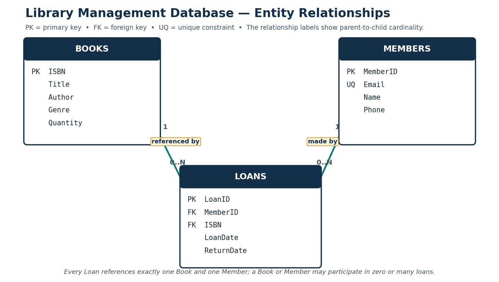
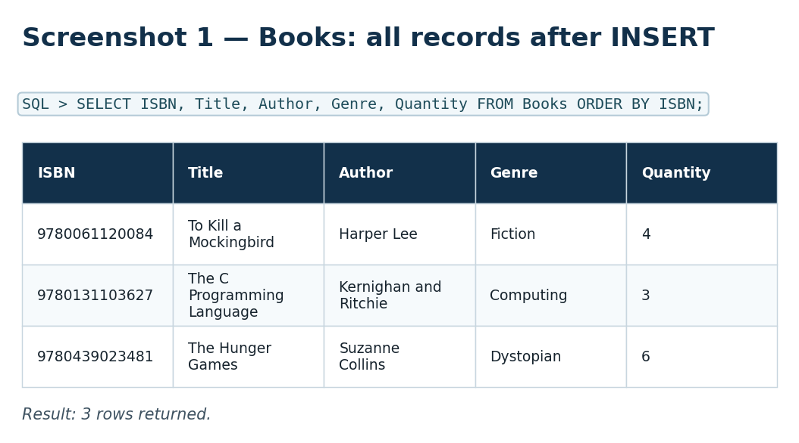
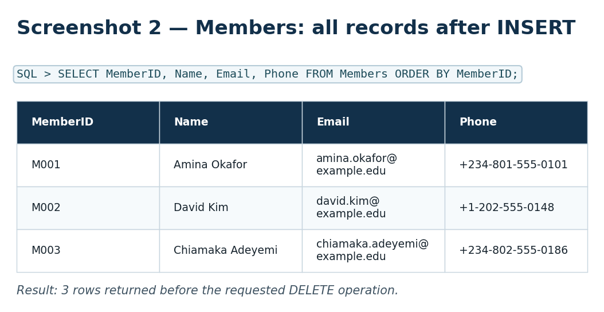
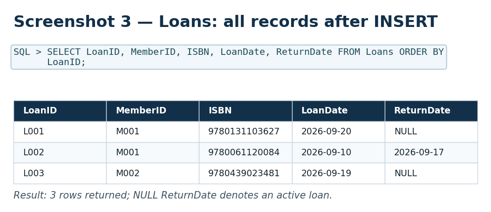
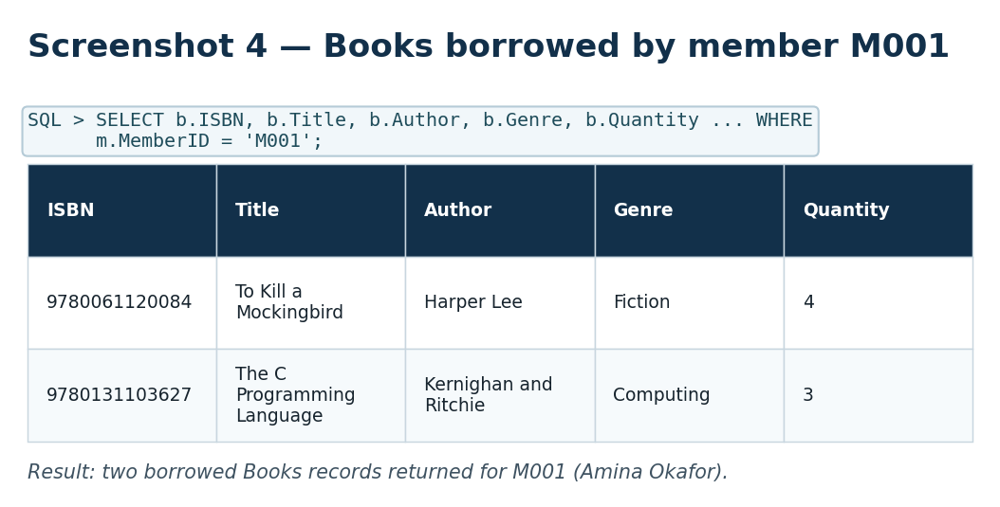
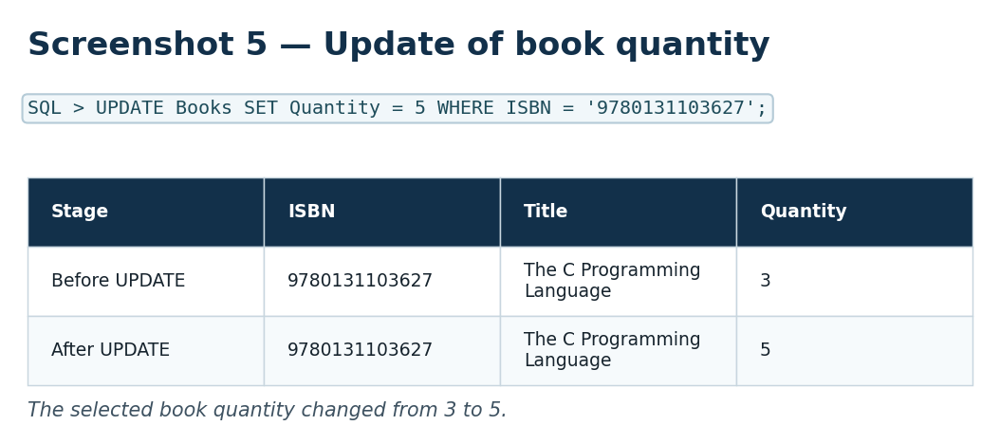
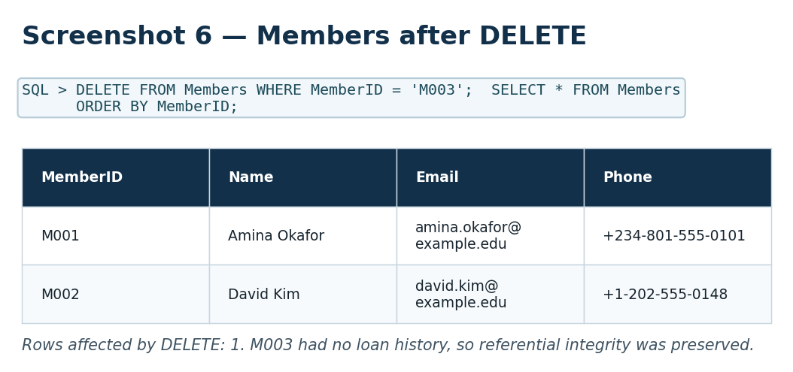

# Library Management Database (SQL)

A compact, normalized **SQLite library management database** built for **CS 2203 — Databases 1, Unit 4**. The project demonstrates core SQL database constructs using a realistic library workflow: defining tables, inserting records, retrieving borrowed books, updating stock, and deleting a member safely.


## Features

- **Normalized schema** with `Books`, `Members`, and `Loans` relations.
- Primary keys, foreign keys, `NOT NULL`, `UNIQUE`, and `CHECK` constraints.
- Referential integrity enabled with `PRAGMA foreign_keys = ON`.
- Fully commented SQL covering `CREATE TABLE`, `INSERT`, `SELECT`, `UPDATE`, and `DELETE`.
- Captured execution evidence for every required operation.
- A Python verification runner that uses only the standard library.

## Entity-Relationship Diagram



### Relationship Rules

| Parent relation | Child relation | Cardinality | Enforcement |
|---|---|---:|---|
| `Books` | `Loans` | One book to zero or many loans | `Loans.ISBN` → `Books.ISBN` |
| `Members` | `Loans` | One member to zero or many loans | `Loans.MemberID` → `Members.MemberID` |

A `Loan` must reference **one existing book** and **one existing member**. The `ON DELETE RESTRICT` rules prevent removal of a book or member that still has loan history.

## Project Structure

```text
library-management-sql/
├── assets/
│   └── library_schema.png                         # ER diagram
├── database/                                      # Created locally by the verifier; ignored by Git
├── docs/
│   └── Unit4_Programming_Assignment_Olufemi_Keripe.docx
├── screenshots/                                   # SQL execution evidence
│   ├── 01_books_after_insert.png
│   ├── 02_members_after_insert.png
│   ├── 03_loans_after_insert.png
│   ├── 04_books_borrowed_m001.png
│   ├── 05_update_quantity.png
│   └── 06_members_after_delete.png
├── scripts/
│   └── verify_library_db.py                       # Rebuilds and validates the demo database
├── sql/
│   └── library_management.sql                     # Fully commented SQL source
├── .gitignore
├── LICENSE
└── README.md
```

## Database Schema

| Table | Primary key | Purpose |
|---|---|---|
| `Books` | `ISBN` | Stores a title, author, genre, and available quantity. |
| `Members` | `MemberID` | Stores borrower information; email is unique. |
| `Loans` | `LoanID` | Records a book loan and links a member to a book. |

### Key Constraints

```sql
Books.Quantity >= 0
Members.Email is UNIQUE
Loans.ReturnDate IS NULL OR Loans.ReturnDate >= Loans.LoanDate
Loans.MemberID → Members.MemberID
Loans.ISBN → Books.ISBN
```

## Quick Start

### Option 1 — Run with Python (recommended)

Python 3 is the only requirement; the runner uses Python’s built-in `sqlite3` module.

```bash
git clone https://github.com/YOUR-USERNAME/library-management-sql.git
cd library-management-sql
python scripts/verify_library_db.py
```

The script creates `database/library_management.db`, executes the SQL file, prints final table contents, and validates that:

- `The C Programming Language` quantity changed from `3` to `5`.
- Member `M003` was deleted.
- The final database still contains three books, two members, and three loan records.

### Option 2 — Run with the SQLite command-line client

```bash
sqlite3 database/library_management.db < sql/library_management.sql
```

> The SQL source begins by dropping the three tables so that the demonstration can be safely re-run from a clean state.

## SQL Operations Demonstrated

| Operation | SQL category | Result |
|---|---|---|
| Create `Books`, `Members`, and `Loans` | DDL | Builds the database structure and constraints. |
| Insert sample books, members, and loans | DML | Adds realistic sample records. |
| Join `Loans`, `Members`, and `Books` for `M001` | DML | Retrieves all catalogue details for books borrowed by a specific member. |
| Update book quantity by ISBN | DML | Changes the selected title’s quantity from 3 to 5. |
| Delete member `M003` | DML | Removes a member without loan history while preserving referential integrity. |

## Execution Screenshots

### 1. Inserted Books



### 2. Inserted Members



### 3. Inserted Loans



### 4. Books Borrowed by Member `M001`



### 5. Quantity Update



### 6. Member Deletion



## Design Decisions

- **ISBN** is used as a natural key because it identifies the particular book edition in this small catalogue.
- **LoanID** is an independent transaction identifier; `MemberID` and `ISBN` remain foreign keys rather than being duplicated as descriptive fields.
- `ReturnDate` is nullable to represent an active loan.
- `ON DELETE RESTRICT` prevents orphaned loan records. The sample deletion uses `M003`, who intentionally has no loan history.
- The assignment scope stores `Author` as a `Books` attribute. A production system supporting multiple authors per book would introduce `Authors` and `BookAuthors` relations.

## GitHub Publishing

Create an empty GitHub repository named `library-management-sql`, then run:

```bash
git init
git add .
git commit -m "Initial commit: library management SQL project"
git branch -M main
git remote add origin https://github.com/YOUR-USERNAME/library-management-sql.git
git push -u origin main
```

Replace `YOUR-USERNAME` with your GitHub username. Do **not** commit `database/library_management.db`; it is generated automatically and already excluded through `.gitignore`.

## Coursework Sources

- SQLite. (n.d.). *Foreign key support*. https://www.sqlite.org/foreignkeys.html
- Vidhya, V., Jeyaram, G., & Ishwarya, K. R. (2016). *Database management systems*. Alpha Science International. https://search.worldcat.org/title/database-management-systems/oclc/1021806756

## Author

**Olufemi Keripe**
